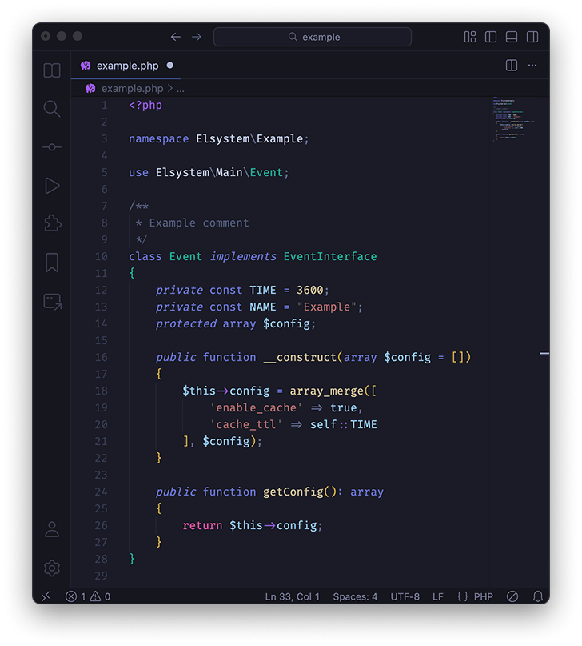

# Mokko Theme for VS Code

A dark theme for Visual Studio Code based on Tokio Night, with customized interface colors and enhanced syntax highlighting for PHP and HTML

Light theme still in dev, but already working

## Installation

1. Download theme
2. Move the folder theme to `/.vscode/extensions`
3. Restart VS Code
5. CMD + P `>Color Theme` select "Mokko Dark" or "Mokko"

## License

MIT
